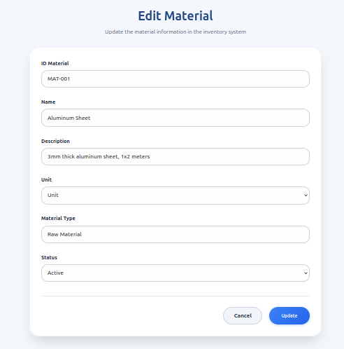
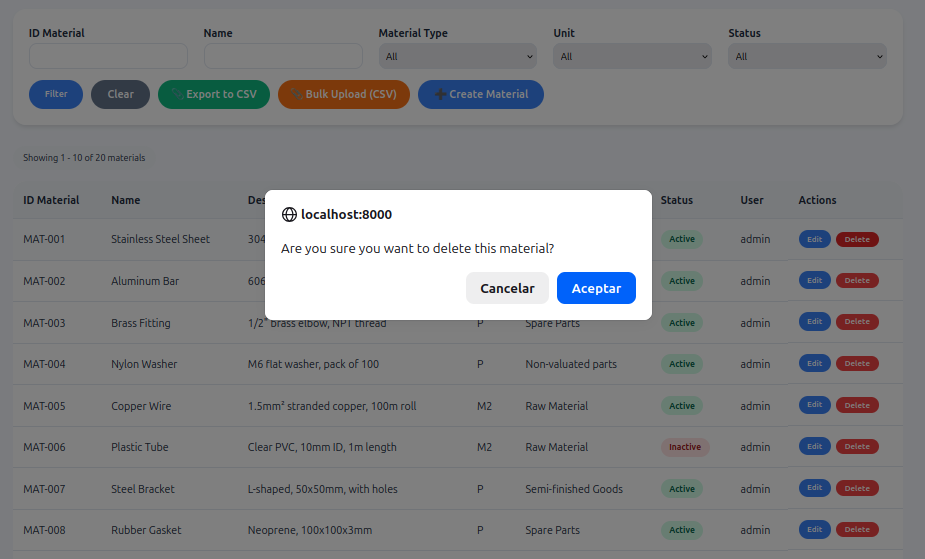
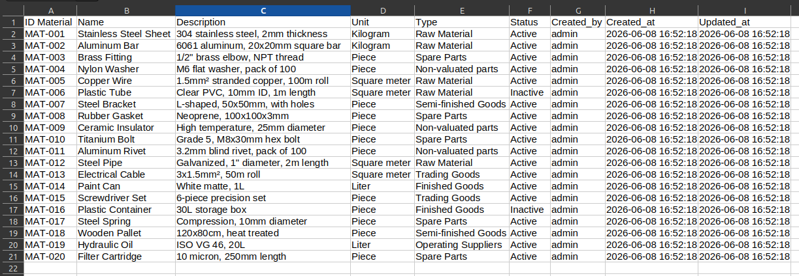
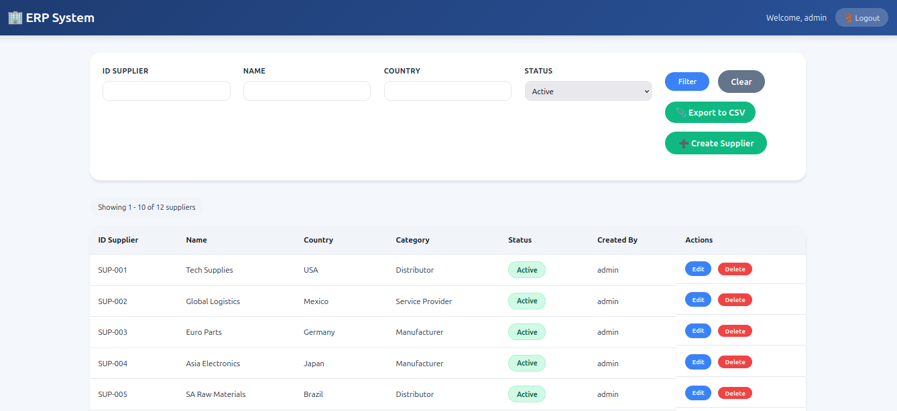
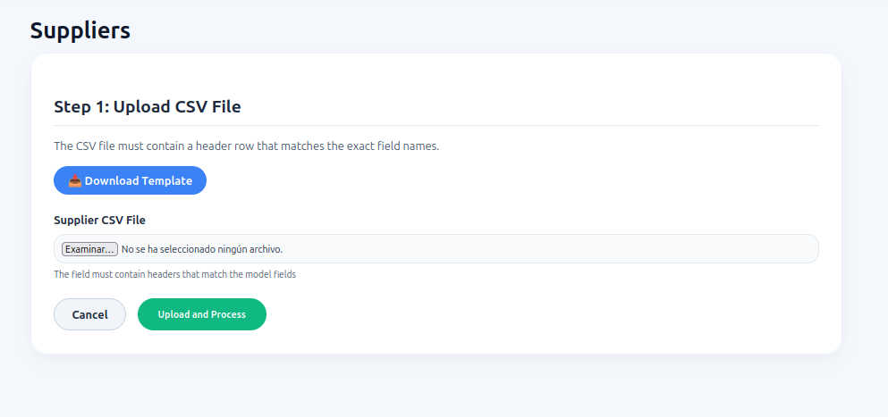
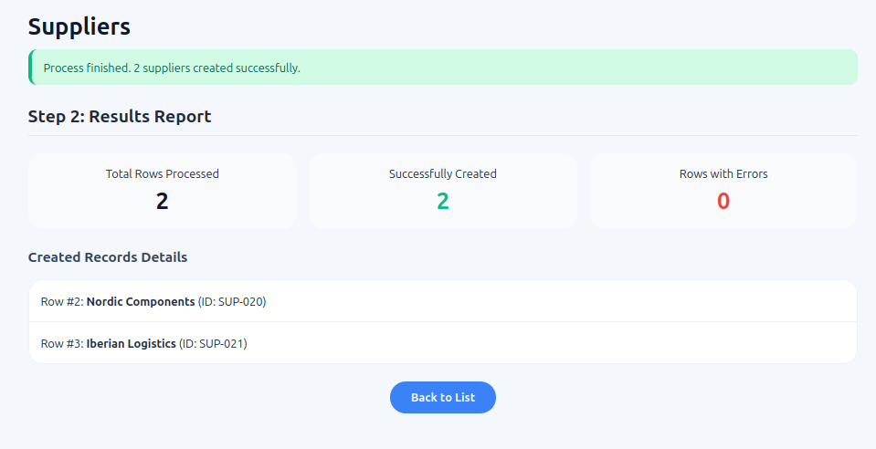
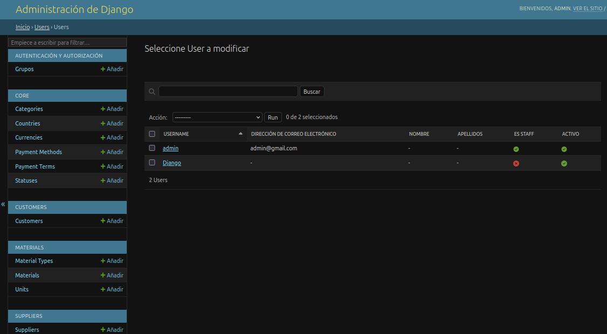
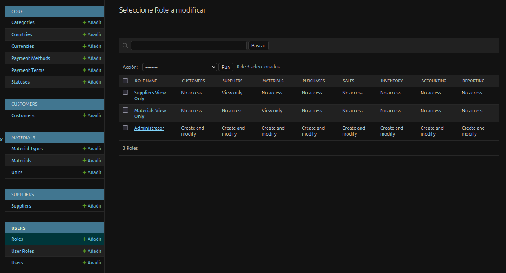
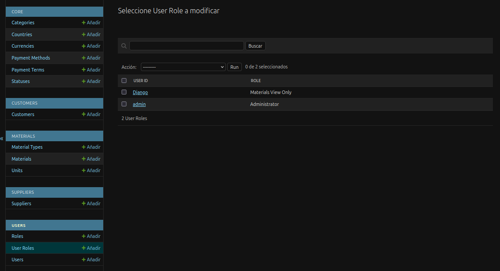

# Sistema ERP (Enterprise Resource Planning)

### Login

### Dashboard

### Gestión de Materiales

### Crear Material

### Editar Material

### Eliminar Material

### Archivo CSV

### Gestión de Proveedores

### Insertar registros de un archivo CSV

### Panel de administración

